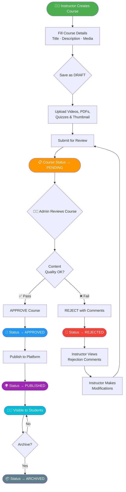
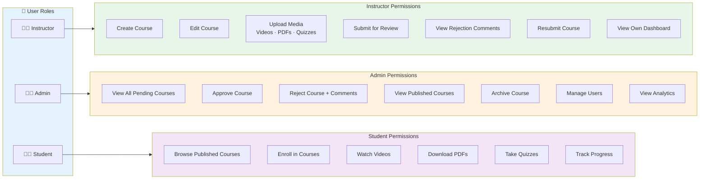
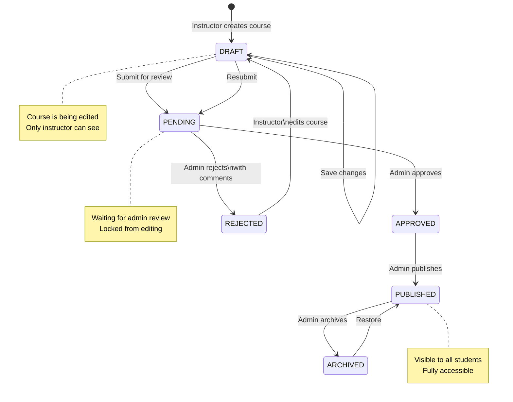
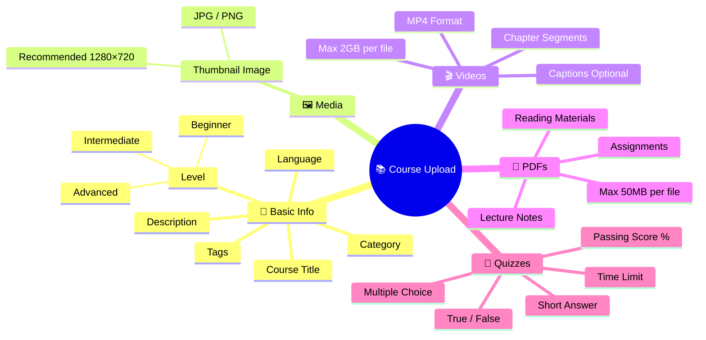
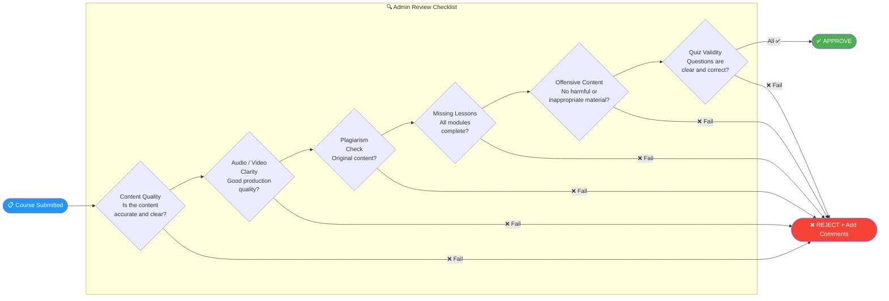
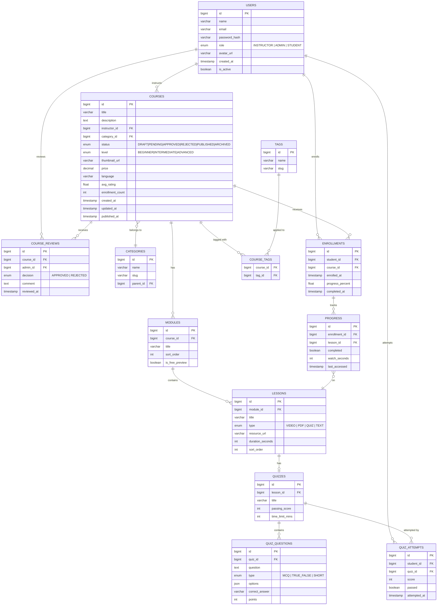
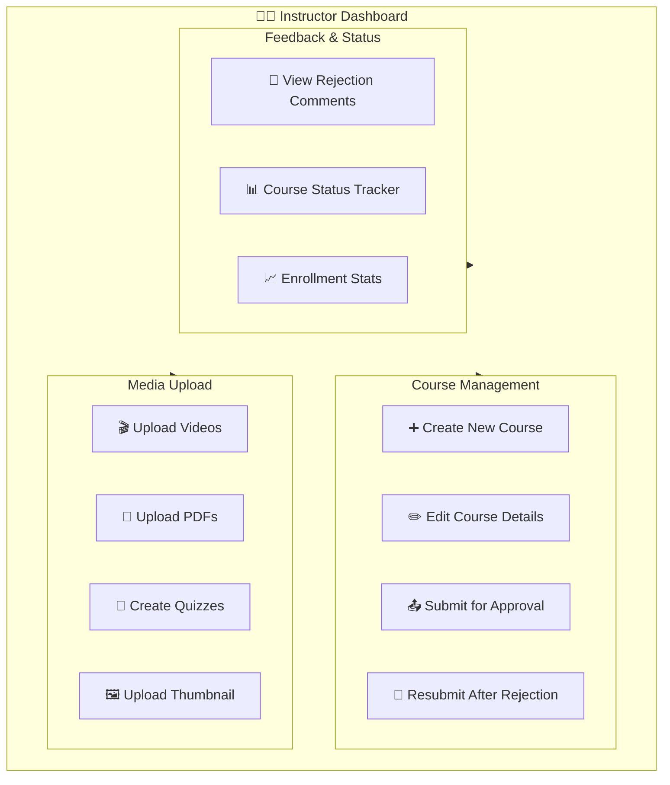
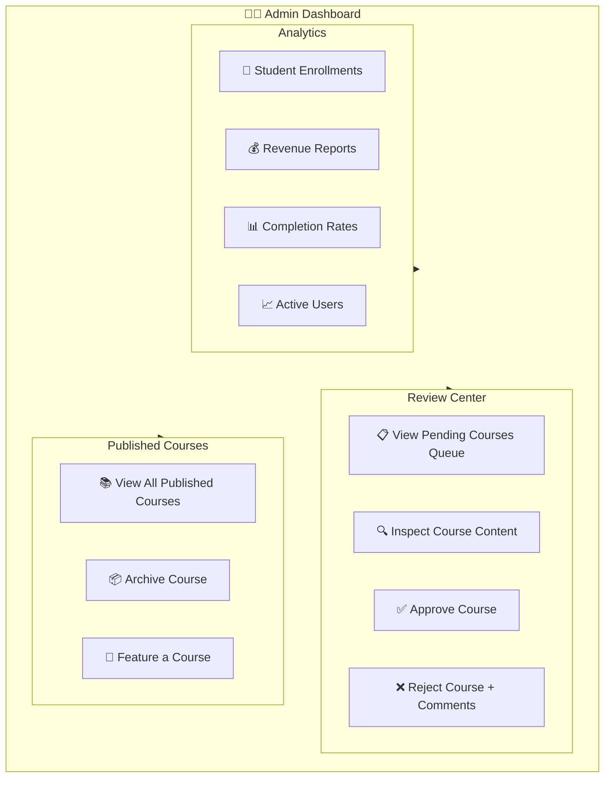

# Course Management System
### React + Spring Boot + SQL — Technical Specification

---

## Table of Contents
1. [System Overview](#1-system-overview)
2. [Course Approval Workflow](#2-course-approval-workflow)
3. [User Roles & Permissions](#3-user-roles--permissions)
4. [Course States & Transitions](#4-course-states--transitions)
5. [Course Upload Requirements](#5-course-upload-requirements)
6. [Admin Review Checklist](#6-admin-review-checklist)
7. [Database Design](#7-database-design)
8. [Frontend Features](#8-frontend-features)
9. [Advanced Search & Filters](#9-advanced-search--filters)
10. [Analytics Dashboard](#10-analytics-dashboard)
11. [System Architecture](#11-system-architecture)

---

## 1. System Overview

A full-stack course management platform enabling instructors to create and submit courses, admins to review and approve content, and students to access published learning materials.

```
┌──────────────┐     ┌──────────────┐     ┌──────────────┐
│  Instructor  │────▶│    Admin     │────▶│   Student    │
│   Creates    │     │   Reviews    │     │   Accesses   │
│   Courses    │     │   Content    │     │   Courses    │
└──────────────┘     └──────────────┘     └──────────────┘
        │                   │                    │
        └───────────────────┴────────────────────┘
                            │
                   ┌────────▼────────┐
                   │  Spring Boot    │
                   │   REST API      │
                   └────────┬────────┘
                            │
                   ┌────────▼────────┐
                   │   PostgreSQL    │
                   │    Database     │
                   └─────────────────┘
```

---

## 2. Course Approval Workflow



---

## 3. User Roles & Permissions



| Role       | Create | Edit | Submit | Review | Approve/Reject | Publish | Enroll |
|------------|--------|------|--------|--------|----------------|---------|--------|
| Instructor | ✅     | ✅   | ✅     | ❌     | ❌             | ❌      | ❌     |
| Admin      | ❌     | ❌   | ❌     | ✅     | ✅             | ✅      | ❌     |
| Student    | ❌     | ❌   | ❌     | ❌     | ❌             | ❌      | ✅     |

---

## 4. Course States & Transitions



### State Descriptions

| State       | Description                            | Who Can See         | Editable |
|-------------|----------------------------------------|---------------------|----------|
| `DRAFT`     | Being created/edited by instructor     | Instructor only     | ✅ Yes   |
| `PENDING`   | Submitted, awaiting admin review       | Instructor + Admin  | ❌ No    |
| `APPROVED`  | Accepted, ready to publish             | Instructor + Admin  | ❌ No    |
| `REJECTED`  | Rejected, needs modification           | Instructor + Admin  | ✅ Yes   |
| `PUBLISHED` | Live and visible to students           | Everyone            | ❌ No    |
| `ARCHIVED`  | Hidden/inactive                        | Admin only          | ❌ No    |

---

## 5. Course Upload Requirements



### Upload Specifications

| Asset       | Format        | Max Size    | Required |
|-------------|---------------|-------------|----------|
| Thumbnail   | JPG / PNG     | 5 MB        | ✅       |
| Videos      | MP4 / MOV     | 2 GB each   | ✅       |
| PDFs        | PDF           | 50 MB each  | Optional |
| Quizzes     | JSON / Form   | N/A         | Optional |
| Captions    | SRT / VTT     | 1 MB each   | Optional |

---

## 6. Admin Review Checklist



---

## 7. Database Design

### Entity Relationship Diagram



### SQL DDL — Core Tables

```sql
-- ─────────────────────────────────────────
-- USERS
-- ─────────────────────────────────────────
CREATE TABLE users (
    id              BIGSERIAL PRIMARY KEY,
    name            VARCHAR(100)  NOT NULL,
    email           VARCHAR(150)  NOT NULL UNIQUE,
    password_hash   VARCHAR(255)  NOT NULL,
    role            VARCHAR(20)   NOT NULL CHECK (role IN ('INSTRUCTOR','ADMIN','STUDENT')),
    avatar_url      VARCHAR(500),
    is_active       BOOLEAN       NOT NULL DEFAULT TRUE,
    created_at      TIMESTAMP     NOT NULL DEFAULT NOW(),
    updated_at      TIMESTAMP     NOT NULL DEFAULT NOW()
);

-- ─────────────────────────────────────────
-- CATEGORIES
-- ─────────────────────────────────────────
CREATE TABLE categories (
    id          BIGSERIAL PRIMARY KEY,
    name        VARCHAR(100) NOT NULL,
    slug        VARCHAR(100) NOT NULL UNIQUE,
    parent_id   BIGINT REFERENCES categories(id) ON DELETE SET NULL
);

-- ─────────────────────────────────────────
-- TAGS
-- ─────────────────────────────────────────
CREATE TABLE tags (
    id    BIGSERIAL PRIMARY KEY,
    name  VARCHAR(50) NOT NULL UNIQUE,
    slug  VARCHAR(50) NOT NULL UNIQUE
);

-- ─────────────────────────────────────────
-- COURSES
-- ─────────────────────────────────────────
CREATE TABLE courses (
    id                BIGSERIAL PRIMARY KEY,
    title             VARCHAR(200)    NOT NULL,
    description       TEXT,
    instructor_id     BIGINT          NOT NULL REFERENCES users(id),
    category_id       BIGINT          REFERENCES categories(id),
    status            VARCHAR(20)     NOT NULL DEFAULT 'DRAFT'
                        CHECK (status IN ('DRAFT','PENDING','APPROVED','REJECTED','PUBLISHED','ARCHIVED')),
    level             VARCHAR(20)     CHECK (level IN ('BEGINNER','INTERMEDIATE','ADVANCED')),
    thumbnail_url     VARCHAR(500),
    price             NUMERIC(10,2)   NOT NULL DEFAULT 0.00,
    language          VARCHAR(50)     NOT NULL DEFAULT 'English',
    avg_rating        NUMERIC(3,2)    DEFAULT 0.00,
    enrollment_count  INT             NOT NULL DEFAULT 0,
    created_at        TIMESTAMP       NOT NULL DEFAULT NOW(),
    updated_at        TIMESTAMP       NOT NULL DEFAULT NOW(),
    published_at      TIMESTAMP
);

CREATE TABLE course_tags (
    course_id   BIGINT NOT NULL REFERENCES courses(id) ON DELETE CASCADE,
    tag_id      BIGINT NOT NULL REFERENCES tags(id)    ON DELETE CASCADE,
    PRIMARY KEY (course_id, tag_id)
);

-- ─────────────────────────────────────────
-- COURSE REVIEWS (Admin decisions)
-- ─────────────────────────────────────────
CREATE TABLE course_reviews (
    id            BIGSERIAL PRIMARY KEY,
    course_id     BIGINT      NOT NULL REFERENCES courses(id) ON DELETE CASCADE,
    admin_id      BIGINT      NOT NULL REFERENCES users(id),
    decision      VARCHAR(20) NOT NULL CHECK (decision IN ('APPROVED','REJECTED')),
    comment       TEXT,
    reviewed_at   TIMESTAMP   NOT NULL DEFAULT NOW()
);

-- ─────────────────────────────────────────
-- MODULES & LESSONS
-- ─────────────────────────────────────────
CREATE TABLE modules (
    id               BIGSERIAL PRIMARY KEY,
    course_id        BIGINT       NOT NULL REFERENCES courses(id) ON DELETE CASCADE,
    title            VARCHAR(200) NOT NULL,
    sort_order       INT          NOT NULL DEFAULT 0,
    is_free_preview  BOOLEAN      NOT NULL DEFAULT FALSE
);

CREATE TABLE lessons (
    id               BIGSERIAL PRIMARY KEY,
    module_id        BIGINT       NOT NULL REFERENCES modules(id) ON DELETE CASCADE,
    title            VARCHAR(200) NOT NULL,
    type             VARCHAR(20)  NOT NULL CHECK (type IN ('VIDEO','PDF','QUIZ','TEXT')),
    resource_url     VARCHAR(500),
    duration_seconds INT,
    sort_order       INT          NOT NULL DEFAULT 0
);

-- ─────────────────────────────────────────
-- QUIZZES
-- ─────────────────────────────────────────
CREATE TABLE quizzes (
    id               BIGSERIAL PRIMARY KEY,
    lesson_id        BIGINT       NOT NULL REFERENCES lessons(id) ON DELETE CASCADE,
    title            VARCHAR(200) NOT NULL,
    passing_score    INT          NOT NULL DEFAULT 70,
    time_limit_mins  INT
);

CREATE TABLE quiz_questions (
    id              BIGSERIAL PRIMARY KEY,
    quiz_id         BIGINT      NOT NULL REFERENCES quizzes(id) ON DELETE CASCADE,
    question        TEXT        NOT NULL,
    type            VARCHAR(20) NOT NULL CHECK (type IN ('MCQ','TRUE_FALSE','SHORT')),
    options         JSONB,
    correct_answer  VARCHAR(500) NOT NULL,
    points          INT          NOT NULL DEFAULT 1
);

-- ─────────────────────────────────────────
-- ENROLLMENTS & PROGRESS
-- ─────────────────────────────────────────
CREATE TABLE enrollments (
    id                BIGSERIAL PRIMARY KEY,
    student_id        BIGINT          NOT NULL REFERENCES users(id),
    course_id         BIGINT          NOT NULL REFERENCES courses(id),
    enrolled_at       TIMESTAMP       NOT NULL DEFAULT NOW(),
    progress_percent  NUMERIC(5,2)    NOT NULL DEFAULT 0.00,
    completed_at      TIMESTAMP,
    UNIQUE (student_id, course_id)
);

CREATE TABLE progress (
    id              BIGSERIAL PRIMARY KEY,
    enrollment_id   BIGINT    NOT NULL REFERENCES enrollments(id) ON DELETE CASCADE,
    lesson_id       BIGINT    NOT NULL REFERENCES lessons(id),
    completed       BOOLEAN   NOT NULL DEFAULT FALSE,
    watch_seconds   INT       NOT NULL DEFAULT 0,
    last_accessed   TIMESTAMP NOT NULL DEFAULT NOW(),
    UNIQUE (enrollment_id, lesson_id)
);

CREATE TABLE quiz_attempts (
    id            BIGSERIAL PRIMARY KEY,
    student_id    BIGINT    NOT NULL REFERENCES users(id),
    quiz_id       BIGINT    NOT NULL REFERENCES quizzes(id),
    score         INT       NOT NULL,
    passed        BOOLEAN   NOT NULL,
    attempted_at  TIMESTAMP NOT NULL DEFAULT NOW()
);

-- ─────────────────────────────────────────
-- INDEXES
-- ─────────────────────────────────────────
CREATE INDEX idx_courses_instructor ON courses(instructor_id);
CREATE INDEX idx_courses_status     ON courses(status);
CREATE INDEX idx_courses_category   ON courses(category_id);
CREATE INDEX idx_enrollments_student ON enrollments(student_id);
CREATE INDEX idx_enrollments_course  ON enrollments(course_id);
CREATE INDEX idx_progress_enrollment ON progress(enrollment_id);
CREATE INDEX idx_lessons_module      ON lessons(module_id);
CREATE INDEX idx_course_reviews_course ON course_reviews(course_id);
```

---

## 8. Frontend Features

### A. Instructor Dashboard



### B. Admin Dashboard



---

## 9. Advanced Search & Filters

```mermaid
flowchart LR
    subgraph SEARCH["🔍 Search & Filter Panel"]
        direction TB
        S1[🔤 Course Name\nFull-text search]
        S2[🧑‍🏫 Instructor\nDropdown select]
        S3[📂 Category\nDropdown select]
        S4[🔖 Status\nDropdown select]
        S5[🎓 Level\nDropdown select]
    end

    subgraph SORT["↕️ Sort Options"]
        direction TB
        T1[🕒 Latest]
        T2[🔥 Most Popular]
        T3[⭐ Highest Rated]
        T4[👥 Most Enrolled]
    end

    subgraph RESULTS["📋 Results"]
        direction TB
        R1[Course Cards Grid]
 
