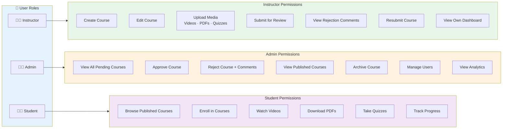
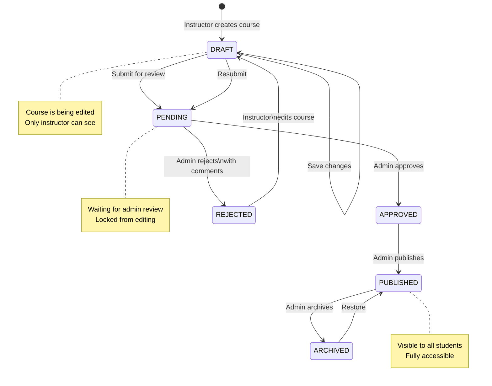
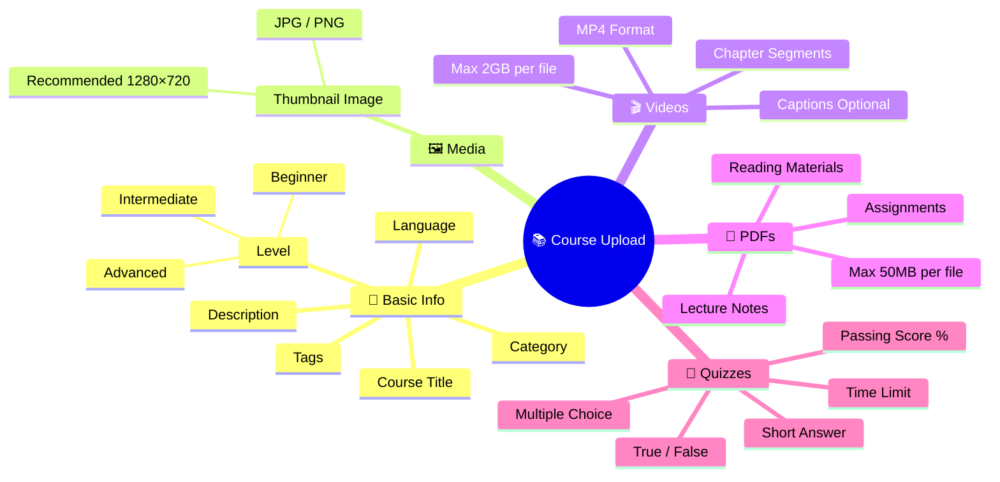
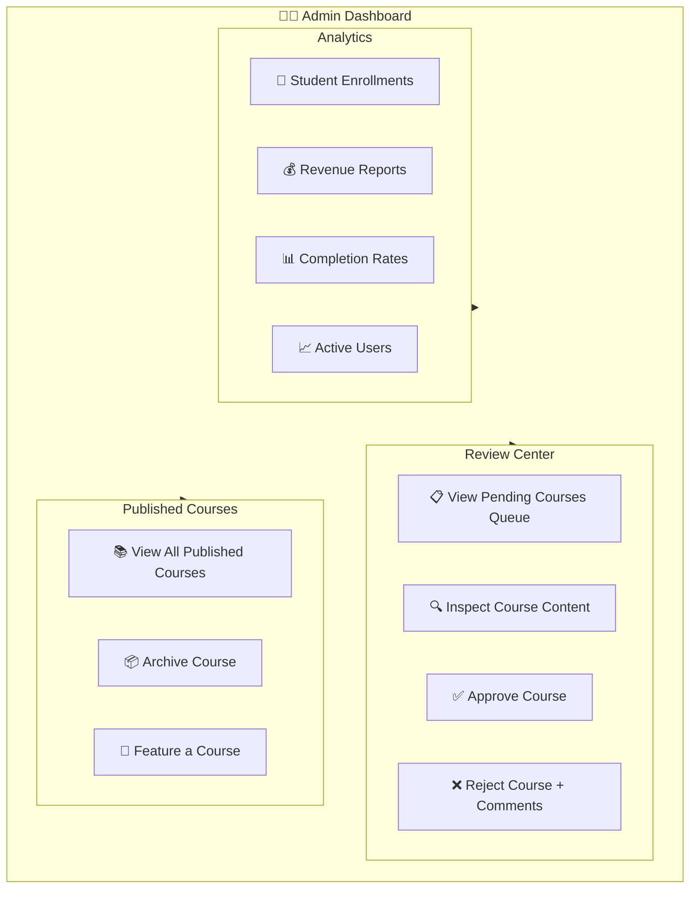
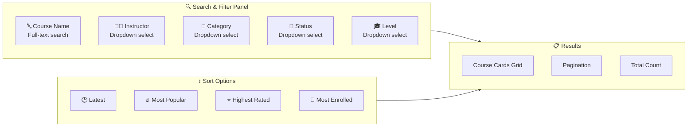
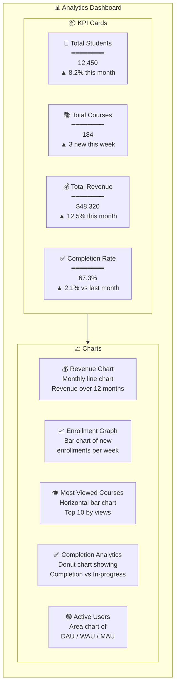
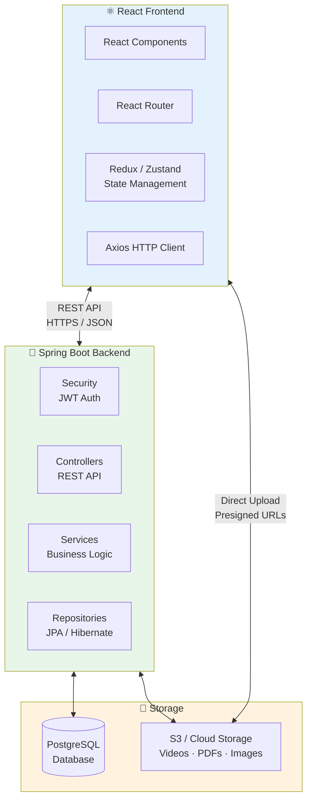

# Course Management System
### React + Spring Boot + SQL — Technical Specification

---

## 1. System Overview

A full-stack course management platform enabling instructors to create and submit courses, admins to review and approve content, and students to access published learning materials.

```
┌──────────────┐     ┌──────────────┐     ┌──────────────┐
│  Instructor  │────▶│    Admin     │────▶│   Student    │
│   Creates    │     │   Reviews    │     │   Accesses   │
│   Courses    │     │   Content    │     │   Courses    │
└──────────────┘     └──────────────┘     └──────────────┘
        │                   │                    │
        └───────────────────┴────────────────────┘
                            │
                   ┌────────▼────────┐
                   │  Spring Boot    │
                   │   REST API      │
                   └────────┬────────┘
                            │
                   ┌────────▼────────┐
                   │   PostgreSQL    │
                   │    Database     │
                   └─────────────────┘
```

---

## 2. Course Approval Workflow


---

## 3. User Roles & Permissions



| Role       | Create | Edit | Submit | Review | Approve/Reject | Publish | Enroll |
|------------|--------|------|--------|--------|----------------|---------|--------|
| Instructor | ✅     | ✅   | ✅     | ❌     | ❌             | ❌      | ❌     |
| Admin      | ❌     | ❌   | ❌     | ✅     | ✅             | ✅      | ❌     |
| Student    | ❌     | ❌   | ❌     | ❌     | ❌             | ❌      | ✅     |

---

## 4. Course States & Transitions



### State Descriptions

| State       | Description                            | Who Can See         | Editable |
|-------------|----------------------------------------|---------------------|----------|
| `DRAFT`     | Being created/edited by instructor     | Instructor only     | ✅ Yes   |
| `PENDING`   | Submitted, awaiting admin review       | Instructor + Admin  | ❌ No    |
| `APPROVED`  | Accepted, ready to publish             | Instructor + Admin  | ❌ No    |
| `REJECTED`  | Rejected, needs modification           | Instructor + Admin  | ✅ Yes   |
| `PUBLISHED` | Live and visible to students           | Everyone            | ❌ No    |
| `ARCHIVED`  | Hidden/inactive                        | Admin only          | ❌ No    |

---

## 5. Course Upload Requirements



### Upload Specifications

| Asset       | Format        | Max Size    | Required |
|-------------|---------------|-------------|----------|
| Thumbnail   | JPG / PNG     | 5 MB        | ✅       |
| Videos      | MP4 / MOV     | 2 GB each   | ✅       |
| PDFs        | PDF           | 50 MB each  | Optional |
| Quizzes     | JSON / Form   | N/A         | Optional |
| Captions    | SRT / VTT     | 1 MB each   | Optional |

---

## 6. Admin Review Checklist


---

## 7. Database Design

### Entity Relationship Diagram

```mermaid
erDiagram
    USERS {
        bigint id PK
        varchar name
        varchar email
        varchar password_hash
        enum role "INSTRUCTOR | ADMIN | STUDENT"
        varchar avatar_url
        timestamp created_at
        boolean is_active
    }

    COURSES {
        bigint id PK
        varchar title
        text description
        bigint instructor_id FK
        bigint category_id FK
        enum status "DRAFT|PENDING|APPROVED|REJECTED|PUBLISHED|ARCHIVED"
        enum level "BEGINNER|INTERMEDIATE|ADVANCED"
        varchar thumbnail_url
        decimal price
        varchar language
        float avg_rating
        int enrollment_count
        timestamp created_at
        timestamp updated_at
        timestamp published_at
    }

    COURSE_REVIEWS {
        bigint id PK
        bigint course_id FK
        bigint admin_id FK
        enum decision "APPROVED | REJECTED"
        text comment
        timestamp reviewed_at
    }

    MODULES {
        bigint id PK
        bigint course_id FK
        varchar title
        int sort_order
        boolean is_free_preview
    }

    LESSONS {
        bigint id PK
        bigint module_id FK
        varchar title
        enum type "VIDEO | PDF | QUIZ | TEXT"
        varchar resource_url
        int duration_seconds
        int sort_order
    }

    QUIZZES {
        bigint id PK
        bigint lesson_id FK
        varchar title
        int passing_score
        int time_limit_mins
    }

    QUIZ_QUESTIONS {
        bigint id PK
        bigint quiz_id FK
        text question
        enum type "MCQ | TRUE_FALSE | SHORT"
        json options
        varchar correct_answer
        int points
    }

    CATEGORIES {
        bigint id PK
        varchar name
        varchar slug
        bigint parent_id FK
    }

    ENROLLMENTS {
        bigint id PK
        bigint student_id FK
        bigint course_id FK
        timestamp enrolled_at
        float progress_percent
        timestamp completed_at
    }

    PROGRESS {
        bigint id PK
        bigint enrollment_id FK
        bigint lesson_id FK
        boolean completed
        int watch_seconds
        timestamp last_accessed
    }

    QUIZ_ATTEMPTS {
        bigint id PK
        bigint student_id FK
        bigint quiz_id FK
        int score
        boolean passed
        timestamp attempted_at
    }

    TAGS {
        bigint id PK
        varchar name
        varchar slug
    }

    COURSE_TAGS {
        bigint course_id FK
        bigint tag_id FK
    }

    USERS ||--o{ COURSES : "instructs"
    USERS ||--o{ ENROLLMENTS : "enrolls"
    USERS ||--o{ COURSE_REVIEWS : "reviews"
    COURSES ||--o{ COURSE_REVIEWS : "receives"
    COURSES ||--o{ MODULES : "has"
    COURSES ||--o{ ENROLLMENTS : "receives"
    COURSES }o--|| CATEGORIES : "belongs to"
    COURSES ||--o{ COURSE_TAGS : "tagged with"
    TAGS ||--o{ COURSE_TAGS : "applied to"
    MODULES ||--o{ LESSONS : "contains"
    LESSONS ||--o| QUIZZES : "has"
    QUIZZES ||--o{ QUIZ_QUESTIONS : "contains"
    ENROLLMENTS ||--o{ PROGRESS : "tracks"
    PROGRESS }o--|| LESSONS : "on"
    USERS ||--o{ QUIZ_ATTEMPTS : "attempts"
    QUIZZES ||--o{ QUIZ_ATTEMPTS : "attempted by"

---

## 8. Frontend Features

### A. Instructor Dashboard

```mermaid
graph TD
    subgraph INSTRUCTOR_DASH["🧑‍🏫 Instructor Dashboard"]
        direction LR

        subgraph COURSE_MGMT["Course Management"]
            C1[➕ Create New Course]
            C2[✏️ Edit Course Details]
            C3[📤 Submit for Approval]
            C4[🔁 Resubmit After Rejection]
        end

        subgraph MEDIA_UPLOAD["Media Upload"]
            M1[🎬 Upload Videos]
            M2[📄 Upload PDFs]
            M3[🧩 Create Quizzes]
            M4[🖼️ Upload Thumbnail]
        end

        subgraph FEEDBACK["Feedback & Status"]
            F1[🔴 View Rejection Comments]
            F2[📊 Course Status Tracker]
            F3[📈 Enrollment Stats]
        end
    end

    INSTRUCTOR_DASH --> COURSE_MGMT
    INSTRUCTOR_DASH --> MEDIA_UPLOAD
    INSTRUCTOR_DASH --> FEEDBACK
```

### B. Admin Dashboard



---

## 9. Advanced Search & Filters



### API Query Example

```sql
SELECT
    c.id,
    c.title,
    u.name        AS instructor_name,
    cat.name      AS category,
    c.status,
    c.level,
    c.avg_rating,
    c.enrollment_count,
    c.created_at
FROM courses c
JOIN users       u   ON c.instructor_id = u.id
JOIN categories  cat ON c.category_id   = cat.id
WHERE
    c.status = 'PUBLISHED'
    AND (c.title ILIKE '%:search%'    OR :search IS NULL)
    AND (u.name  = :instructor        OR :instructor IS NULL)
    AND (cat.name = :category         OR :category IS NULL)
    AND (c.level  = :level            OR :level IS NULL)
ORDER BY
    CASE :sort
        WHEN 'latest'      THEN c.created_at
        WHEN 'most_popular' THEN c.enrollment_count
        WHEN 'highest_rated' THEN c.avg_rating
        WHEN 'most_enrolled' THEN c.enrollment_count
    END DESC
LIMIT :pageSize OFFSET :offset;
```

---

## 10. Analytics Dashboard

### Dashboard Components



### Dashboard Chart Specifications

| Chart | Type | X-Axis | Y-Axis | Period |
|---|---|---|---|---|
| Revenue Chart | Line | Month | Revenue ($) | 12 months |
| Enrollment Graph | Bar | Week | New Enrollments | 90 days |
| Most Viewed Courses | Horizontal Bar | Course Name | Views | All time |
| Completion Analytics | Donut | — | Completed vs In Progress | All time |
| Active Users | Area | Date | User Count | 30 days |

---

## 11. System Architecture

### Component Architecture



### API Endpoint Summary

```
Auth
  POST   /api/auth/register
  POST   /api/auth/login
  POST   /api/auth/refresh

Courses (Instructor)
  POST   /api/courses                    Create draft
  PUT    /api/courses/{id}               Update course
  POST   /api/courses/{id}/submit        Submit for review
  POST   /api/courses/{id}/resubmit      Resubmit after rejection
  GET    /api/instructor/courses         My courses list

Courses (Admin)
  GET    /api/admin/courses/pending      Pending queue
  POST   /api/admin/courses/{id}/approve Approve
  POST   /api/admin/courses/{id}/reject  Reject with comment
  GET    /api/admin/courses/published    All published

Courses (Public / Student)
  GET    /api/courses                    Browse published
  GET    /api/courses/{id}               Course detail
  POST   /api/courses/{id}/enroll        Enroll

Media
  POST   /api/upload/video               Upload video
  POST   /api/upload/pdf                 Upload PDF
  POST   /api/upload/thumbnail           Upload thumbnail

Analytics
  GET    /api/admin/analytics/overview   KPI summary
  GET    /api/admin/analytics/revenue    Revenue chart
  GET    /api/admin/analytics/enrollments Enrollment graph
  GET    /api/admin/analytics/top-courses Most viewed
```
